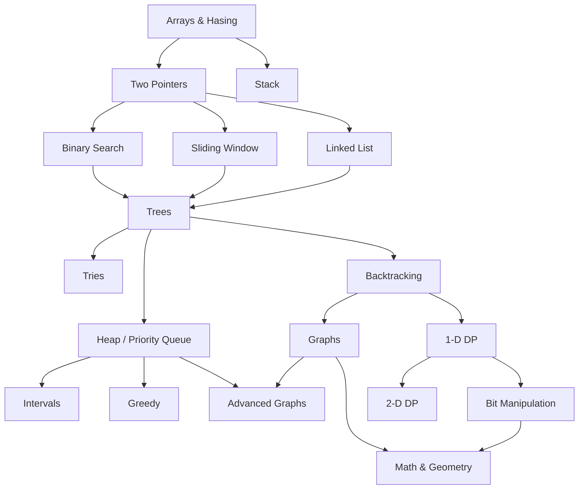

# NeetCode Roadmap

## Graph

---

> `*` are premium questions on LeetCode

## Arrays & Hashing

### Contains Duplicate (Easy)

### Valid Anagram (EASY)

### Two Sum (Easy)

### Group Anagrams (Medium)

### Top K Frequent Elements (Medium)

### Product of Array Except Self (Medium)

### Valid Sudoku (Medium)

### \*Encode and Decode Strings (Medium)

### Longest Consecutive Sequence (Medium)

---

## Stack

### Valid Parentheses (Easy)

### Min Stack (Medium)

### Evaluate Reverse Polish Notation (Medium)
